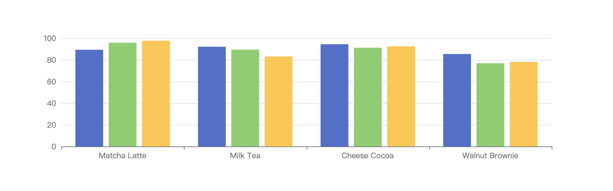

# Data Visualization Part I

## What

We would like to explore the insight of business data by having a chat with LLM and then visualizing it with Echarts diagram.

### Goal

- given a dataset

  | Product        | 2015 | 2016 | 2017 |
  | -------------- | ---- | ---- | ---- |
  | Matcha Latte   | 43.3 | 85.8 | 93.7 |
  | Milk Tea       | 83.1 | 73.4 | 55.1 |
  | Cheese Cocoa   | 86.4 | 65.2 | 82.5 |
  | Walnut Brownie | 72.4 | 53.9 | 39.1 |

- visualize the data with Echarts

  - the type of the chart is also given by LLM

    - for example 'bar' chart or 'line' chart
    - the theme of the chart is pre-set

  

## How

### Inputs

- chat with LLM

### Outputs

- metrics / dimensions

- business data base on above

  - chart dataset

- chart type

### Stages

- 1st stage: find the measure, metrics and dimensions from conversation

  > by prompt / example selectors

  [metrics](https://developers.google.com/analytics/devguides/reporting/core/v3/reference#metrics) need to break down into [dimensions](https://developers.google.com/analytics/devguides/reporting/core/v3/reference#dimensions)

  - in the given example above
    - the measure is 'number of sales in 1000 units'
    - the metric is 'product'
    - the dimension is 'year'

- 2nd stage: retrieve the data from database

  > by prompt / example selectors

  - by SQL API ?

- 3rd stage: recommend the chart type

  - by LLM

- 4th stage: visualize the chart

  - by Our Own API
