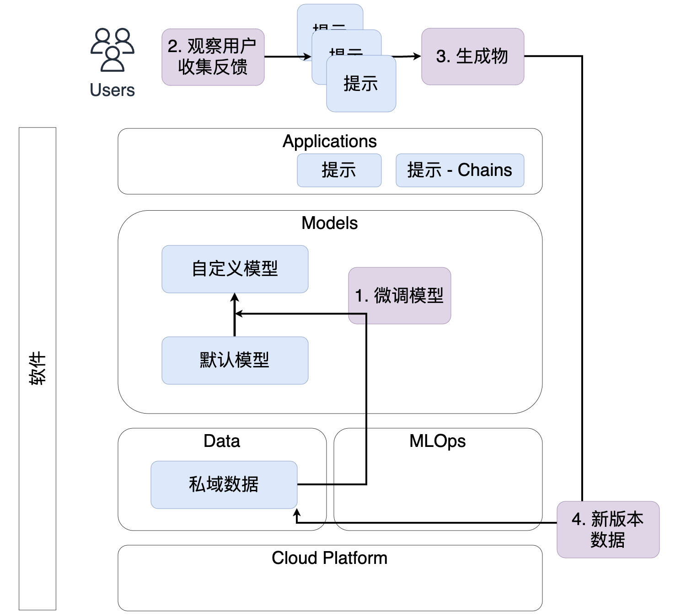

# Data Visualization Part II

## 解决方案架构

> AI 应用层

## Text 2 Data Vis 解决方案

### Steps

- text to params

  - given prompt template and example selectors

    - extract `measures, metrics, dimensions and conditions` from text

- text to sql

  - given prompt template and example selectors

    - prompt template (pseudo code)

      `select {metrics, dimensions} from {#source table} group by {measure} where {conditions}`

- data to chart

### Key Components

- [LLama2]()
- [SQLDatabaseChain]()
- [Ollama](https://python.langchain.com/docs/integrations/chat/ollama)
- [pandas](https://python.langchain.com/docs/integrations/toolkits/pandas)

## Todos

- TBD

## References

- [facebookresearch / This demo shows how to use LangChain's SQLDatabaseChain with Llama2 to query structured data stored in a SQL DB.](https://github.com/facebookresearch/llama-recipes/blob/main/demo_apps/StructuredLlama.ipynb)

- [langchain / LLaMA2 chat with SQL](https://github.com/langchain-ai/langchain/blob/master/cookbook/LLaMA2_sql_chat.ipynb)

- [langchian / qa_structured](https://python.langchain.com/docs/use_cases/qa_structured/sql)
