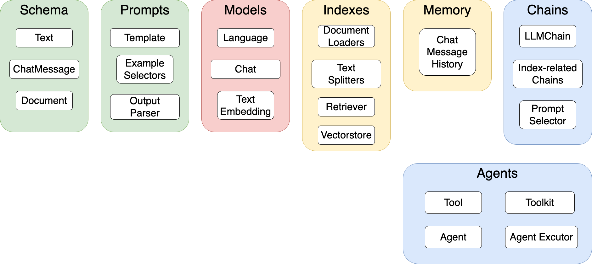

# Langchain 学习指南

## I/O

## 大模型

## Proprietary Data

## Chains

### Async API

支持并发调用

### Call Methods

- `__call__`
- run
- apply
- generate
- predict
- predict_and_parser

### Serialization

## Agents
